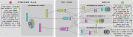

# Multi-Head RAG (MRAG)

<p align="center">
  
</p>

This is the official implementation of [Multi-Head RAG: Solving Multi-Aspect Problems with LLMs](https://arxiv.org/pdf/2406.05085.pdf).

This framework implements Multi-Head RAG (MRAG), a novel scheme focused on
queries that may require fetching multiple documents with substantially
different contents. Such queries occur frequently, but are challenging because
the embeddings of these documents may be distant in the embedding space, making
it hard to retrieve them all. The idea of MRAG is simple yet powerful:
leveraging activations of Transformer's multi-head attention layer, instead of
the decoder layer, as keys for fetching multi-aspect documents. The driving
motivation is that different attention heads can learn to capture different
data aspects. Harnessing the corresponding activations results in embeddings
that represent various facets of data items and queries, improving the
retrieval accuracy for complex queries.


## Setup Guide

In order to use this framework, you need to have a working installation of Python 3.9 or newer.


### Installing MRAG

Before running either of the following two installation methods, make sure to activate your Python environment (if any) beforehand.
If you are a user and you just want to use `MRAG`, you can install it from source:
```bash
git clone https://github.com/spcl/MRAG.git
cd MRAG
pip install .
apt-get install docker-compose
```

If you are a developer and you want to modify the code, you can install it in editable mode from source:
```bash
git clone https://github.com/spcl/MRAG.git
cd MRAG
pip install -e .
apt-get install docker-compose
```


## Quick Start
The first steps are the generation of a synthetic datasets as well as synthetic queries.
```
multirag-cli datagen
export OPENAI_API_KEY=<api key>
multirag-cli querygen
```
These three commands will recreate a synthetic dataset with the same number of categories and documents in
each category as used during the evaluation in the paper. The same goes for the synthetic query generation.
Please note that the generation of the synthetic queries uses OpenAI LLMs, which incur a cost.
If you wish to use different parameter, please read the documentation of the command line interface of both commands:
- [datagen](multirag/dataset/README.md#synthetic-dataset-generation)
- [querygen](multirag/dataset/README.md#synthetic-query-generation)

If you want to avoid those costs or do not want to wait for the generation (roughly 40 minutes for both), you can use the already prepared Wikipedia-based dataset and queries in the [datasets](datasets) folder.

The next step is the generation of the embeddings for the dataset and the queries.
```
multirag-cli embed
```
The command above will use the Salesforce/SFR-Embedding-Mistral embedding model and only generates the attention head embeddings for the last layer.
The documentation of the command line interface can be found [here](multirag/embed/README.md).

```
multirag-cli db start
multirag-cli db import
```
After setting up the vector database, the embedding data is imported into the vector database.
The documentation of the command line interface can be found [here](multirag/storage/README.md#command-line-interfaces).

```
multirag-cli evaluate
```
The evaluation command will run several different strategies on the query embeddings and the document embedddings in the vector database.
The documentation of the command line interface can be found [here](multirag/evaluation/README.md).

```
multirag-cli plot
```
The plot command generates various plots to visualize the evaluation data.
Its command line interface is described in the documentation of [Plot](multirag/plot/README.md) module.


## Documentation
The paper gives a high-level overview of the framework and its components.
In order to understand the framework in more detail, you can read the documentation of the individual modules.
The [Dataset](multirag/dataset/README.md) module describes the generation of the synthetic dataset as well as the generation of the synthetic queries.
The [Embed](multirag/embed/README.md) module describes the embedding generation for the dataset and the queries.
The [Storage](multirag/storage/README.md) module describes how to interact with the vector database.
The [Evaluation](multirag/evaluation/README.md) module describes the various strategies used during the evaluation.
The [Plot](multirag/plot/README.md) module describes the visualization of the evaluation data.


## Paper Results

The [datasets](datasets) directory contains the datasets that we used to evaluate MRAG, which generated the results presented in the paper.
They can serve as starting point for learning how to use the framework.
However, if you just want to inspect and replot the results, you can use the [paper](paper) directory.


## Citations

If you find this repository valuable, please give it a star!
Got any questions or feedback? Feel free to reach out and open an issue.
Using this in your work? Please reference us using the provided citation:

```bibtex
@misc{besta2024multihead,
  title = {{Multi-Head RAG: Solving Multi-Aspect Problems with LLMs}},
  author = {Besta, Maciej and Kubicek, Ales and Niggli, Roman and Gerstenberger, Robert and Weitzendorf, Lucas and Chi, Mingyuan and Iff, Patrick and Gajda, Joanna and Nyczyk, Piotr and M\"{u}ller, J\"{u}rgen and Niewiadomski, Hubert and Chrapek, Marcin and Podstawksi, Micha\{}l and Hoefler, Torsten},
  year = 2024,
  month = June,
  eprinttype = {arXiv},
  eprint = {2406.05085}
}
```
